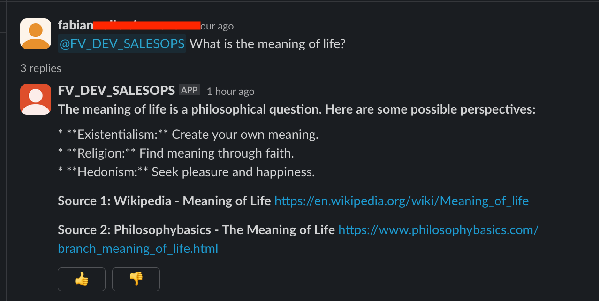
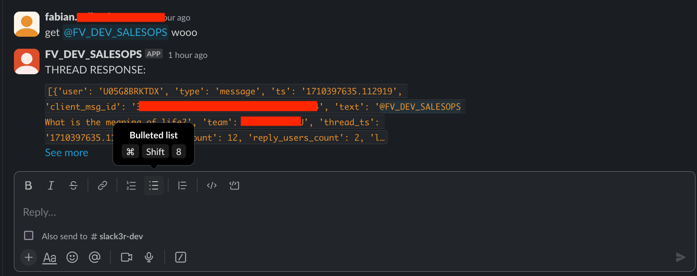

**slackbot-starter-kit: Your Path to Effortless Slack Bot Development**

Ready to build a Slack bot without the hassle? This starter kit was designed specifically to streamline the process, putting the focus directly where it belongs – on building the unique features that make your bot stand out. 

**Why Choose slackbot-starter-kit?**

* **Uncomplicated Start:** Dive right into development without the need to decode complex frameworks or reinvent basic Slack interactions.
* **Functionality First:**  Let the kit handle the core Slack communication while you define your bot's logic and the heart of its user experience.
* **Unleash Your Creativity:** Our API-driven approach to Slack blocks gives you complete control over crafting dynamic, engaging interactions. 
* **Sustainable Development:**  The project's organized structure promotes easy maintenance and adaptability. Modify features or adapt to Slack updates without major code restructuring.

**Key Features**

* **Robust Base:** Built upon the powerful Slack Bolt framework for Python, ensuring reliable and scalable bot interactions.
* **API-Driven Blocks:**  A dedicated Flask API layer for generating Slack blocks (the UI elements of messages). This approach streamlines block creation and keeps your Slackbot code focused.
* **Thread Support:** Handles message threads, enabling context-aware responses and continuous conversation flows.
* **Reaction Feedback:** Includes built-in mechanisms for users to provide feedback (e.g., thumbs up/down) on bot responses.
* **Dependency Management:**  A `requirements.txt` file clearly outlines project dependencies, ensuring reproducible setups across different environments and simplifying collaboration.

**Screenshots**





**Getting Started**

1. **Clone the repo:**
   ```bash
   git clone https://github.com/ranfysvalle02/slackbot-starter-kit.git
   ```

2. **Install dependencies:**
   ```bash
   pip3 install -r requirements.txt
   ```

3. **Set up your Slack App:** 
   * **Create a Slack App**
     * Visit [https://api.slack.com/apps](https://api.slack.com/apps) to create a new Slack app.

   * **Permissions & Socket Mode**
     * Enable Socket Mode for real-time interaction.  
     * Add the following bot token scopes to your Slack App:
       * `channels:read`
       * `channels:history`
       * `groups:history`
       * `im:history`
       * `chat:write`
       * `reactions:write`
       * `reactions:read`
       * `users:read`
       * `app_mentions:read`

   * **Install to Workspace**
     * Install your app into your desired Slack workspace.

4. **Configure environment variables:**  Create a `.env` file to store your Slack bot token and app secrets.

5. **Run the Flask API:**
   ```bash
   python3 rag-api.py
   ```

6. **Start the Slackbot:**
   ```bash
   python3 slackbot.py
   ```

**Customization**

* Expand the Flask API to provide more sophisticated responses and data retrieval.
* Create new Slack block layouts and actions for unique bot interactions.
* Integrate with external services to enhance your bot's capabilities.

**Contribute**

We welcome contributions! Feel free to:

* Open issues for bug reports or feature requests.
* Submit pull requests to improve code or add functionality.

**Let's build amazing Slack bots together!** 
